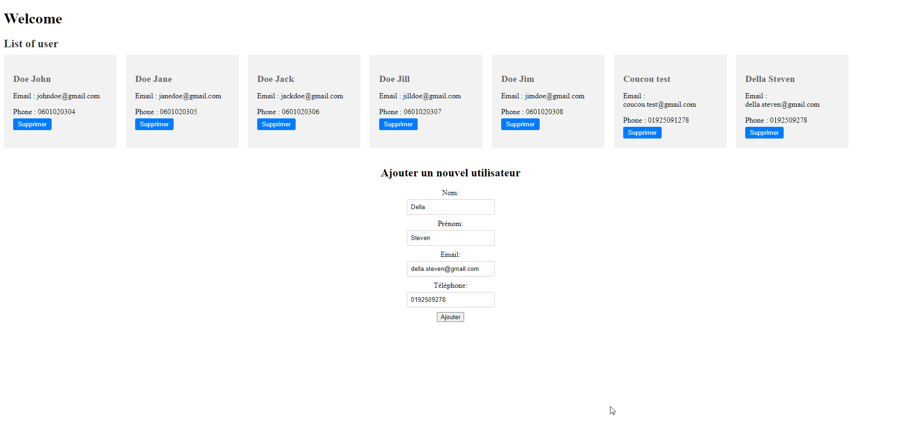
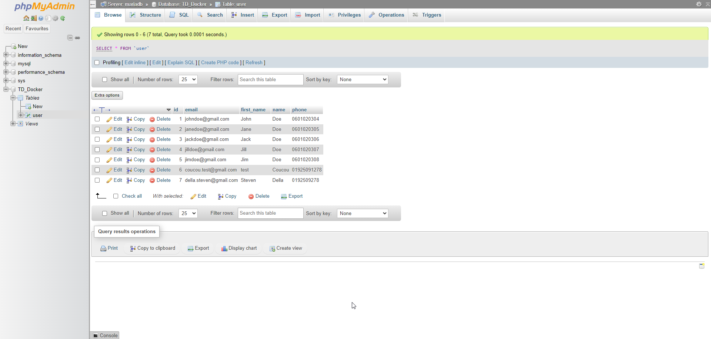

## Docker TD

Résultat du TD sur Docker réalisé par Kévin Barbin et Steven Della-rica.

# Séparation des couches en image Docker

Nous avons donc utilisé des Dockerfiles à la racine des dossiers contenant les 2 couches principales, la couche front et la couche bff / api. 
Chaque Dockerfile nous permet de monter une image docker avec une couche d'application.

# La couche Front

Nous utilisons tout simplement une image déjà existante nginx, et nous allons copier les fichier présent dans le dossier /browser dans le conteneur nginx créé, grâce aux lignes de commande `FROM` et `COPY`.
Après la création du Dockerfile, nous utilisons la commande `docker build -t nomutilisateurdockerhub/nom_app`, pour ma part ce sera `docker build -t stevendella/front_app`

# Dockerfile de la couche Back

Pour la couche back, nous avons utilisé l'image demandé de java 21 jdk grâce à la ligne de commande `FROM mdsol/java21-jdk`, puis nous définissons un dossier qui va accueillir notre application `WORKDIR /app`, et nous copions les fichiers du dossier target à l'intérieur de ce nouveau dossier `COPY ./target/* /app/`.
Enfin nous exécutons les commandes nécessaires au fonctionnement de notre application java `CMD ["java", "-jar", "/app/bff-0.0.1-SNAPSHOT.jar"]`.

# application-docker.properties

Pour effectuer correctement une liaison avec notre base de données, il est essentiel de configurer ce fichier:
`spring.application.name` nous permet de nommer notre application.
`spring.datasource.url` nous permet de donner le lien vers notre database, nous pouvons écrire `jdbc:mariadb://mariadb:3306/TD_Docker`. "jdbc:mariadb" correspondant au protocole qui permet la communication entre l'application java et la BDD et à la base de donnée en question qui sera de type `mariadb`. `mariadb` après le `://` correspond au nom de l'hôte ou à l'adresse ip du serveur MariaDB, en l'occurence ici ce sera dans une autre image docker que nous allons configurer dans le docker-compose plus tard. `3306` correspond au port de connexion à utiliser et enfin `TD_Docker` correspond au nom de la base de donnée à laquelle se connecter.
`spring.datasource.username=${USERNAME}` & `spring.datasource.password=${PASSWORD}` nous permettent d'indiquer le nom d'utilisateur et le mot de passe qui nous permettent de se connecter à notre base de données, ici elles sont variabilisées pour ne pas être en clair sur git hub.
Je n'ai pas modifier le reste, je suppose que ce sont des protocoles et/ou des commandes nécessaires au bon fonctionnement de l'application et de la base de données.

# Build de la couche Back

Une fois tout configuré, nous pouvons build notre image grâce à la ligne `docker build -t stevendella/back_app`

# Docker compose-up

Abordons maintenant le docker-compose.yml qui va nous permettre de mettre en place toutes nos images et services pour les faire fonctionner au sein d'une même application.
`version: '3.8'` nous permet tout simplement de définir la version que nous utilisons.
`services:` nous permet de faire la liste des services que nous allons utiliser et mettre en place à travers ce docker-compose.yml.

1er service : MariaDB :
`mariadb:` est le nom que nous donnons à ce service, nous allons préciser quel est ce service après.
`image: mariadb:latest` est le nom de l'image docker que nous allons utiliser et donc télécharger si nous l'avons pas au moment du docker compose up.
`env_file:- .env` est équivalent à la ligne `environment:` elle nous permet de configurer les accès à la base de données, sauf qu'elles sont dans un fichier à part nommé .env pour ne pas avoir besoin de le pusher sur git hub et avoir les accès en clair sur le repository.

Voici l'intérieur du fichier .env
`#mariadb services`
`MYSQL_ROOT_PASSWORD=root`
`MYSQL_DATABASE=TD_Docker`
`MYSQL_USER=root`
`MYSQL_PASSWORD=root`

`#bff services`
`USERNAME=root`
`PASSWORD=root`

`#phpmyadmin services`
`PMA_HOST=mariadb`

`#front services`
`BFF_URL=http://bff:80`
Il est mutualisé pour être utilisé dans les différents service.

`volumes:- ./data_base:/var/lib/mysql` nous permet de créer un volume à part, ce qui va créer un dossier avec l'intégrité de notre base de données mariadb, pour avoir un back up en cas de soucis.
`networks:- backend` permet aux conteneurs de communiquer entre eux de manière isolée du réseau hôte.

2eme service : Back end :
`bff` sera le nom de notre service back end.
`image: stevendella/back_app` nous permet d'utiliser l'image que nous avons build tout à l'heure.
`ports:- "8080:8080"` nous permet de spécifier le port du back de notre application, ce sera le port 8080.
`env_file:- .env` comme vu plus tôt, cette ligne permet à notre application d'utiliser un fichier externe dans lequel il y a le nom d'utilisateur et le mot de passe pour accéder à la base de donnée.
`depends_on:- mariadb` nous permet de préciser le service auquel dépend ce service et auquel il doit se référer.
`networks:- backend` on spécifie le networks pour les services qui vont fonctionner ensemble.

3eme service : phpMyAdmin :
Encore une fois pas de nouveautés, nous utilisons l'`image: phpmyadmin`, nous lui attribuons le `ports:- "8081:80"`, on configure son `environment:- PMA_HOST=mariadb - MYSQL_ROOT_PASSWORD=root` en précisant le service utilisé et le mot de passe, ici il se trouve dans le fichier .env.

4eme service : Front end :
Pas de nouveautés, nous utilisons l'image front build précédemment nommée `stevendella/front_app`, nous lui attribuons le `port:-4200:80` pour accéder à cette interface grâce à l'adresse "localhost:4200" car c'est une application Angular et nous lui attribuons le `networks:-backend` pour délimiter clairement la communication entre les services.

`networks: backend:` nous permet de mettre en place la communication isolée des différents services comme nous l'avons vu plus tôt.

# Docker hub

Images sur docker hub afin qu'elles soient accessibles:

- backend : 
    [lingatsu/backend](https://hub.docker.com/r/lingatsu/backend)
    [stevendella/back_app](https://hub.docker.com/r/stevendella/back_app)
- frontend : 
    [lingasu/frontend](https://hub.docker.com/r/lingatsu/frontend)
    [stevendella/front_app](https://hub.docker.com/r/stevendella/front_app)

Git Hub de [Kévin](https://github.com/Lingatsu/td-docker)

# Résultat Final

